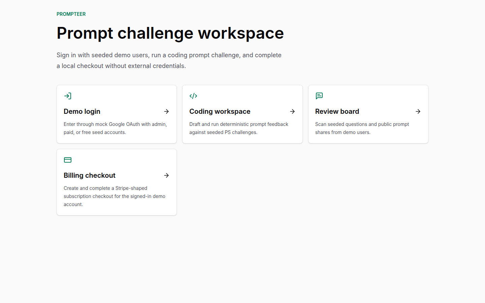
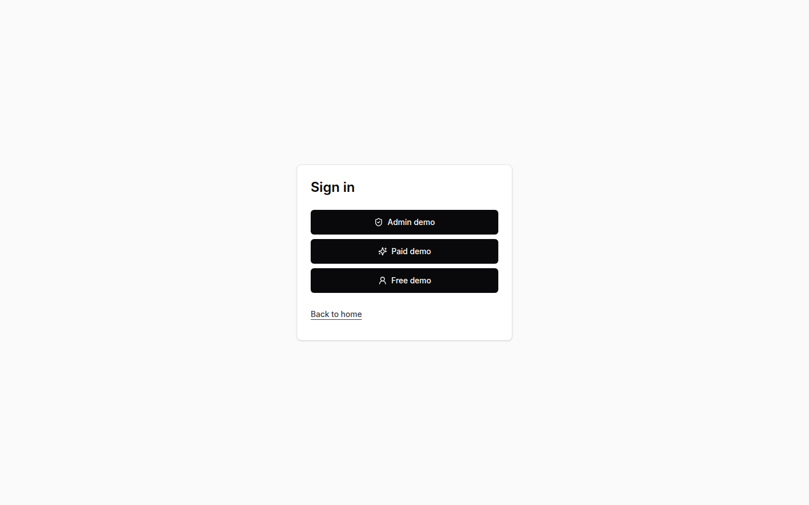
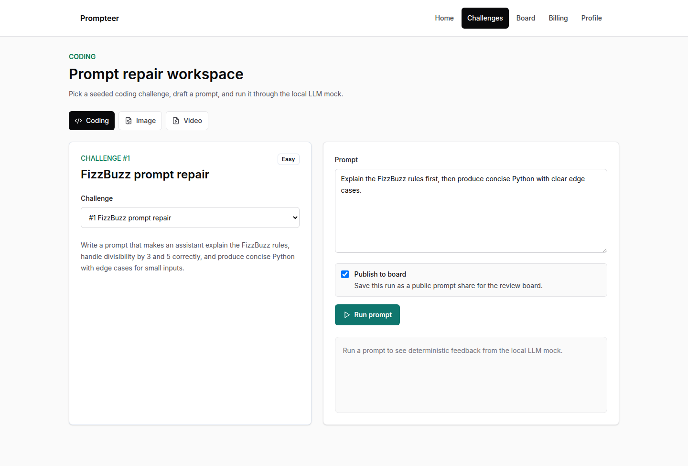
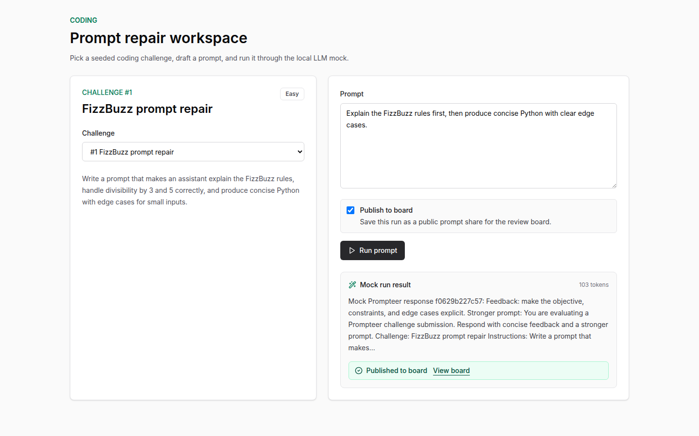
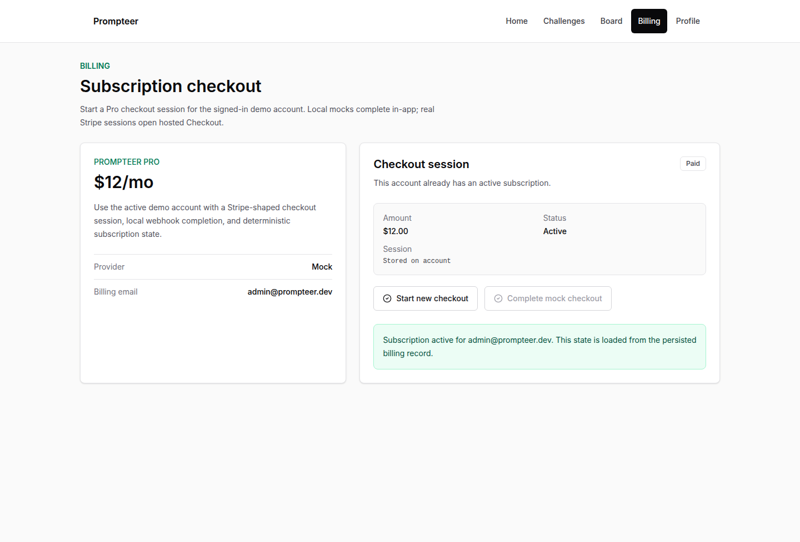
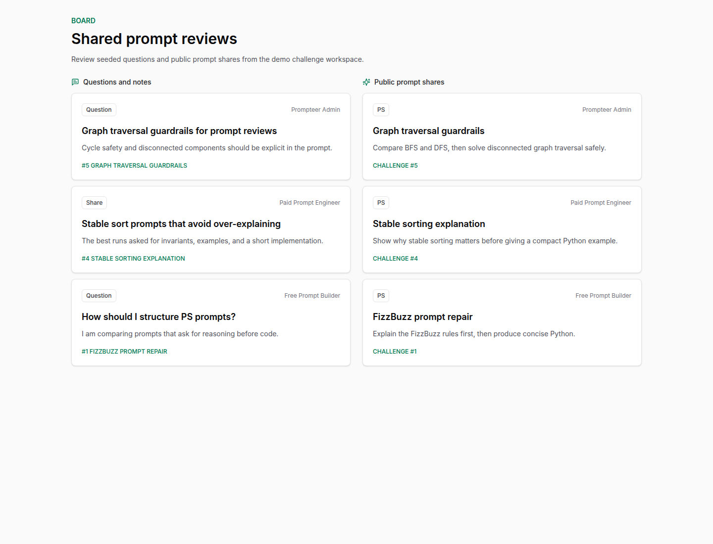
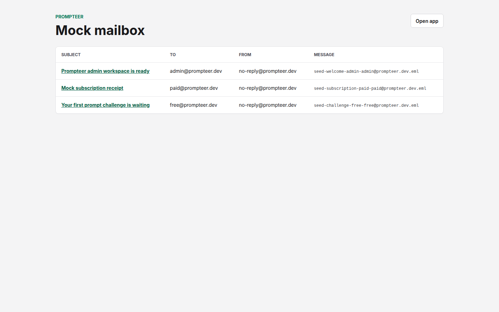
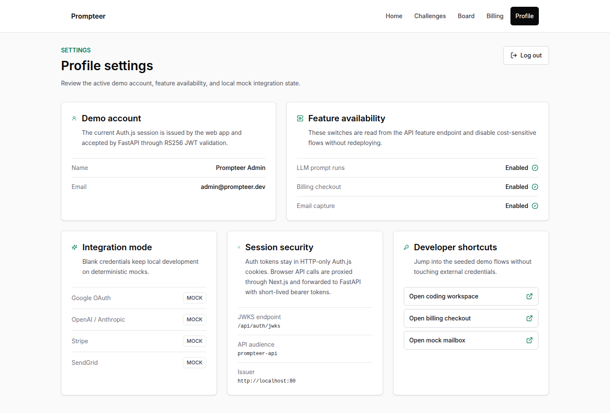
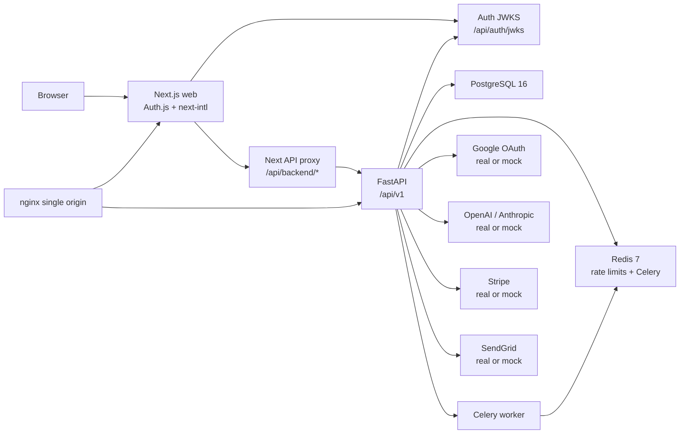

# Prompteer

Prompt challenge workspace for practicing prompts, comparing deterministic mock outputs, and sharing reviewable challenge runs.

[](https://github.com/PrompteerAI/Prompteer/actions/workflows/ci.yaml) [](https://github.com/PrompteerAI/Prompteer/actions/workflows/build.yaml) [](LICENSE) [](.nvmrc) [](apps/api/.python-version) [](https://github.com/orgs/PrompteerAI/packages/container/package/prompteer-web) [](https://github.com/PrompteerAI/Prompteer/commits/main)



## What Is Prompteer

Prompteer is a clean monorepo rebuild of a prompt challenge and sharing prototype. It combines a Next.js app, FastAPI API, seeded demo data, and schema-faithful local mocks for Google OAuth, OpenAI, Anthropic, Stripe, and SendGrid so contributors can run the complete product without external credentials.

## Quick Start

No external API keys are required; blank provider credentials automatically select local mocks.

Prerequisites for local development:

- Docker Engine with Docker Compose v2
- Node.js 22; `.nvmrc` pins the project version
- Corepack enabled so `packageManager: pnpm@10.12.1` is honored: `corepack enable`
- `uv` for Python dependency management

Containerized demo:

```sh
git clone https://github.com/PrompteerAI/Prompteer.git && cd Prompteer
cp .env.example .env
./scripts/compose-up.sh --build
```

Open `http://localhost`. The default Compose stack serves the app through nginx as one origin, with `/` routed to the web app and `/api/` routed to FastAPI. If `HTTP_PORT` is changed in `.env`, open `http://localhost:<HTTP_PORT>`.

Hot-reload development from a fresh clone:

```sh
git clone https://github.com/PrompteerAI/Prompteer.git && cd Prompteer
cp .env.example .env
./scripts/compose-up.sh postgres redis
pnpm dev
```

`pnpm dev` self-installs missing workspace dependencies on first run, then starts Next.js on `WEB_PORT` and FastAPI on `API_PORT`. The `pnpm` and `uv` command-line tools themselves must already be installed.

## Screenshots & Demo

| Landing workspace                                                                           | Mock Google login                                                                    | Coding challenge list                                                                          |
| ------------------------------------------------------------------------------------------- | ------------------------------------------------------------------------------------ | ---------------------------------------------------------------------------------------------- |
|  |  |  |

| Prompt editor and run result                                                               | Billing upgrade checkout                                                                           | Review board feed                                                                  |
| ------------------------------------------------------------------------------------------ | -------------------------------------------------------------------------------------------------- | ---------------------------------------------------------------------------------- |
|  |  |  |

| Mock mailbox captured email                                                         | Profile settings and session controls                                                      |
| ----------------------------------------------------------------------------------- | ------------------------------------------------------------------------------------------ |
|  |  |

The verified local demo covers seed login, prompt execution through the LLM mock, Stripe-shaped checkout completion, review board reads, profile settings, logout, and captured SendGrid email viewing.

## Architecture



Next.js owns authentication and signs RS256 session/API JWTs. Browser mutations go through the same-origin API proxy so Auth.js cookies stay HTTP-only while FastAPI still receives bearer credentials for per-user rate limits and LLM quotas. FastAPI stores domain data in PostgreSQL, uses Redis for shared rate-limit state and Celery, and emits RFC 9457 Problem Details for API errors. See [docs/architecture.md](docs/architecture.md) for deeper notes and ADR links.

## Repository Layout

Prompteer is organized as a monorepo with clear runtime boundaries:

```text
apps/
  web/          Next.js frontend, Auth.js, UI, Playwright e2e
  web-legacy/   Legacy-design Next.js preview backed by the rebuilt APIs
  api/          FastAPI backend, SQLModel/Alembic, Celery, provider mocks
packages/
  shared-types/ Generated OpenAPI TypeScript types
  eslint-config/ Shared ESLint flat config
  tsconfig/     Shared TypeScript config
infra/
  nginx/        Single-origin reverse proxy
  postgres/     PostgreSQL initialization hooks
  compose/      Compose overlays
docs/           Public architecture, ADR, runbook, integration, and screenshot docs
scripts/        Root developer and verification entrypoints
```

Root files are repository-level contracts, not frontend/backend ownership leaks.
`package.json` orchestrates pnpm workspaces, Turborepo, Husky, and commitlint;
the frontend package still lives at `apps/web/package.json`, and the backend
package lives at `apps/api/pyproject.toml`. `.env.example` is the canonical
local stack contract consumed by Compose, the web app, the API, and the worker so
`cp .env.example .env` is enough for local development. Service-specific
production deployments can still inject only the variables each service needs.

Use this command when inspecting the structure locally; it hides `node_modules`, `.venv`, `.next`, `.verify`, caches, and other generated output that make a raw `tree` look mixed:

```sh
make tree
```

## Tech Stack

Frontend:

- [Next.js 15](https://nextjs.org/) App Router with [React 19](https://react.dev/) and strict [TypeScript](https://www.typescriptlang.org/)
- [Tailwind CSS v4](https://tailwindcss.com/), [lucide-react](https://lucide.dev/), [next-intl](https://next-intl.dev/)
- [Auth.js v5](https://authjs.dev/), [TanStack Query](https://tanstack.com/query), [React Hook Form](https://react-hook-form.com/), [Zod](https://zod.dev/)
- [openapi-fetch](https://openapi-ts.dev/openapi-fetch/) over generated OpenAPI types for schema-checked API calls
- [Sentry for Next.js](https://docs.sentry.io/platforms/javascript/guides/nextjs/) is wired as an optional no-op-until-configured error capture path
- [Vitest](https://vitest.dev/) and [Playwright](https://playwright.dev/) with headless Chromium coverage

Backend:

- [Python 3.12](https://www.python.org/) and [FastAPI](https://fastapi.tiangolo.com/)
- [SQLModel](https://sqlmodel.tiangolo.com/), [Alembic](https://alembic.sqlalchemy.org/), [PostgreSQL 16](https://www.postgresql.org/)
- [Celery](https://docs.celeryq.dev/), [Redis 7](https://redis.io/), [slowapi](https://slowapi.readthedocs.io/)
- [structlog](https://www.structlog.org/), [asgi-correlation-id](https://github.com/snok/asgi-correlation-id), [Sentry Python](https://docs.sentry.io/platforms/python/), [Ruff](https://docs.astral.sh/ruff/), [pytest](https://docs.pytest.org/)

Infrastructure:

- [pnpm workspaces](https://pnpm.io/workspaces), [uv](https://docs.astral.sh/uv/), [Turborepo](https://turbo.build/repo)
- [Docker Compose](https://docs.docker.com/compose/), [nginx](https://nginx.org/), [GitHub Actions](https://docs.github.com/actions)
- Images are built for [GHCR](https://ghcr.io/) as `prompteer-web` and `prompteer-api`

## Development

Install dependencies:

```sh
pnpm install
uv sync --project apps/api --dev
```

Bootstrap a fresh machine:

```sh
./scripts/bootstrap.sh
```

Run the hot-reload local development stack:

```sh
./scripts/compose-up.sh postgres redis
pnpm dev
```

Run both frontend designs side by side:

```sh
./scripts/compose-up.sh postgres redis
pnpm dev:legacy
```

`apps/web-legacy` opens on `WEB_LEGACY_PORT=3001` by default and recreates the
old Prompteer frontend design against the rebuilt backend. The primary
`apps/web` process still owns Auth.js, JWKS, and `/api/backend/*`; the legacy
preview proxies authenticated calls through that gateway so both frontend
designs can run without a second token issuer.

Run frontend and backend independently:

```sh
pnpm --filter @prompteer/web dev
pnpm --filter @prompteer/web-legacy dev
make api-dev
```

Hot-reload ports are configured in `.env` with `WEB_PORT=3000` and
`WEB_LEGACY_PORT=3001`, and `API_PORT=8000`. Compose host ports are configured with `HTTP_PORT=80`,
`POSTGRES_PORT=55432`, and `REDIS_PORT=56379`; `COMPOSE_BIND_HOST=127.0.0.1`
keeps published ports local-only by default. Compose injects `HTTP_PORT` into the
containerized public origin used by Auth.js, API JWT issuer checks, and mock
OAuth. `make e2e` and `make verify-ui` derive their browser target from
`HTTP_PORT` unless `PLAYWRIGHT_BASE_URL` or `PROMPTEER_WEB_URL` are explicitly
overridden. The dev scripts derive `APP_URL`, `AUTH_URL`, JWKS, and mock Google
issuer URLs from the hot-reload ports so a local port change stays consistent.

Run tests:

```sh
pnpm test
cd apps/api && uv run pytest
make e2e
```

Run lint, typecheck, and formatting:

```sh
pnpm lint
pnpm typecheck
pnpm format:check
cd apps/api && uv run ruff check . && uv run mypy app tests
```

Run the full local verification suite:

```sh
make verify
```

Capture desktop and mobile UI screenshots against Docker Compose:

```sh
make verify-ui
```

Add a database migration:

```sh
cd apps/api
uv run alembic revision --autogenerate -m "describe change"
uv run alembic upgrade head
```

Regenerate OpenAPI and shared TypeScript API types:

```sh
make types
make types-check
```

Migrate and seed demo data plus captured mock emails:

```sh
make seed
```

Reset the local Docker database and Redis volumes, then recreate the demo state:

```sh
make reset
```

## External Integrations

| Integration  | Real-mode env vars                              | Local mock behavior                                                         | Schema notes                                                              |
| ------------ | ----------------------------------------------- | --------------------------------------------------------------------------- | ------------------------------------------------------------------------- |
| Google OAuth | `GOOGLE_CLIENT_ID`, `GOOGLE_CLIENT_SECRET`      | Local OIDC provider with seeded admin/paid/free users and JWKS              | [google-oauth.md](docs/integrations/google-oauth.md), verified 2026-05-21 |
| OpenAI       | `OPENAI_API_KEY`, optional `OPENAI_CHAT_MODEL`  | Deterministic Chat Completions responses and SSE chunks                     | [openai.md](docs/integrations/openai.md), verified 2026-05-21             |
| Anthropic    | `ANTHROPIC_API_KEY`, optional `ANTHROPIC_MODEL` | Deterministic Messages responses and Anthropic-shaped SSE events            | [anthropic.md](docs/integrations/anthropic.md), verified 2026-05-21       |
| Stripe       | `STRIPE_SECRET_KEY`, `STRIPE_WEBHOOK_SECRET`    | Checkout Session create/retrieve/expire/complete with local webhook signing | [stripe.md](docs/integrations/stripe.md), verified 2026-05-21             |
| SendGrid     | `SENDGRID_API_KEY`                              | Mail Send validation, `.eml` capture, and `/dev/mailbox` viewer             | [sendgrid.md](docs/integrations/sendgrid.md), verified 2026-05-21         |

## Deployment

Production runs behind nginx as one origin: `/` routes to the Next.js web app and `/api/` routes to FastAPI. GitHub Actions lint, typecheck, test, build, and publish images to GHCR. PostgreSQL backups, restores, and migration safety are documented in [docs/runbooks/backup-restore.md](docs/runbooks/backup-restore.md) and [docs/runbooks/migrations.md](docs/runbooks/migrations.md).

## Contributing

Read [CONTRIBUTING.md](CONTRIBUTING.md) before opening issues or pull requests. The project uses Conventional Commits, pre-commit hooks, focused tests, and ADRs for load-bearing design decisions.

## License

MIT - see [LICENSE](LICENSE).

## Acknowledgments

This repository is a clean rewrite of an earlier Vite + React and FastAPI prototype originally built by a small student team.
