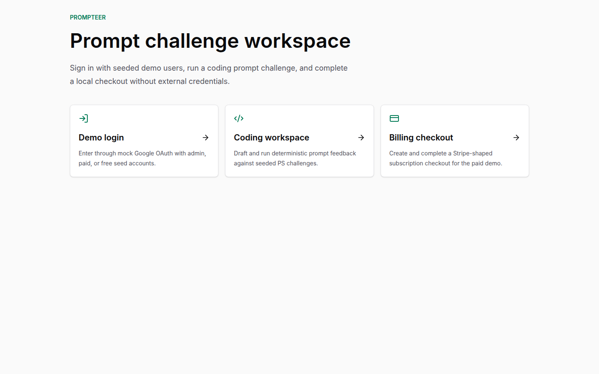

# Prompteer

Prompteer is a prompt challenge and sharing platform rebuilt as a production-ready monorepo.

The target local contract is:

```sh
cp .env.example .env
docker compose up -d
pnpm dev
```

With no external API keys, the app uses deterministic local mocks for Google OAuth, LLM providers, Stripe, and SendGrid.

## Workspace

- `apps/web` - Next.js App Router frontend
- `apps/api` - FastAPI backend
- `packages/*` - shared TypeScript configuration and types
- `infra/*` - nginx, Postgres, and Compose support files
- `docs/*` - public architecture, ADRs, runbooks, screenshots, and integration notes

## Status

The rebuild is in progress. See `docs/architecture.md` and `docs/adr/` for accepted design decisions.

## Current Verified Slice

The current scaffold starts the FastAPI and Next.js development servers together, supports mock Google OAuth login through Auth.js, and includes a seeded coding challenge workspace that runs prompts through the deterministic local LLM mock:

```sh
cp .env.example .env
docker compose up -d
pnpm install
uv sync --project apps/api --dev
pnpm dev
```

Health checks:

- Web: `http://localhost:3000/api/health`
- API: `http://localhost:8000/api/v1/health/live`
- API readiness: `http://localhost:8000/api/v1/health/ready`

The default Compose command starts only PostgreSQL and Redis so local `pnpm dev` can own ports 3000 and 8000. To run the containerized app topology with API, worker, web, and nginx:

```sh
docker compose --profile app up -d
```

Seed demo data:

```sh
make seed
```

The seed command is idempotent and creates demo users, prompt challenge categories, coding exercises, one public share, one board post, and captured mock emails for `/api/v1/dev/mailbox`.

Mock Google OAuth demo accounts:

- `admin@prompteer.dev`
- `paid@prompteer.dev`
- `free@prompteer.dev`




## Verification

The scaffold currently passes:

```sh
pnpm lint
pnpm typecheck
pnpm test
cd apps/api && uv run ruff check .
cd apps/api && uv run ruff format --check .
cd apps/api && uv run mypy app tests
cd apps/api && uv run pytest
pnpm --filter @prompteer/web build
```

The login flow was also verified in headless Chromium against local FastAPI and Next.js servers: selecting `Admin demo` completes the mock Google OIDC authorization-code flow and redirects back to `/en`.

The coding challenge workspace was verified in headless Chromium against a production Next.js build and local FastAPI API: `/en/challenges/coding` loads seeded PS challenges and `Run prompt` returns deterministic mock LLM feedback.
