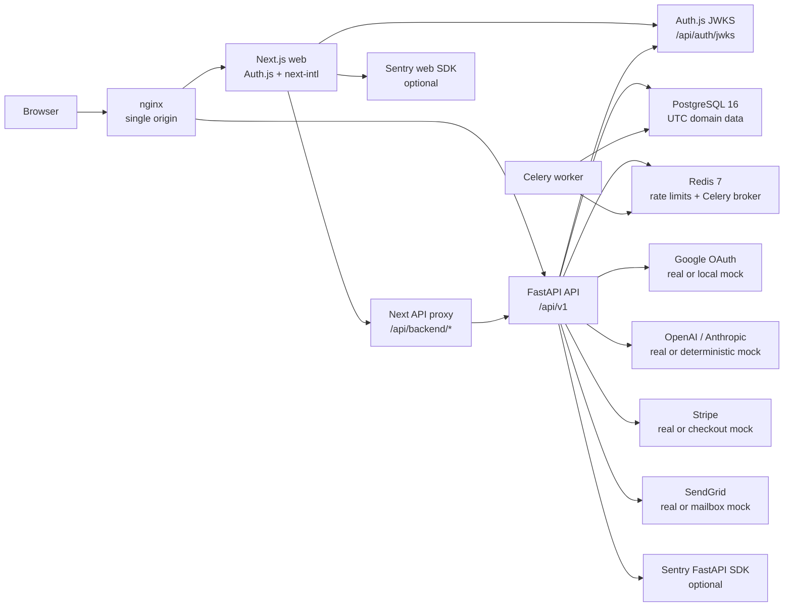

# Architecture

Prompteer is a monorepo with a Next.js web app, a FastAPI API, PostgreSQL, Redis, Celery workers, and nginx as the single-origin reverse proxy.

## Service diagram

## Local topology

- `docker compose up -d` starts the full stack behind nginx at `http://localhost`
  by default, or `http://localhost:<HTTP_PORT>` when the nginx host port is
  changed in `.env`. Compose injects the same public origin into Auth.js, API
  JWT issuer checks, and mock OAuth settings.
- The Compose web and API containers stay on the Docker network without publishing host ports 3000 or 8000.
- The API container is supervised by Gunicorn with `uvicorn_worker.UvicornWorker`; `API_UVICORN_WORKERS` controls the number of Uvicorn worker processes and defaults to `1`, bounded by `API_UVICORN_WORKERS_MAX`.
- `pnpm dev` starts hot-reload Next.js and FastAPI dev servers on `WEB_PORT` and `API_PORT`, which default to `3000` and `8000`.
- `apps/web-legacy` is a non-authoritative preview frontend for the legacy visual design. It depends on the primary `apps/web` service for Auth.js sessions, JWKS, and the `/api/backend/*` API proxy, so it does not issue tokens or define backend contracts.
- Compose publishes nginx, PostgreSQL, and Redis through `HTTP_PORT`, `POSTGRES_PORT`, and `REDIS_PORT`, which default to `80`, `55432`, and `56379`.
- Server-rendered web reads call the API through `API_INTERNAL_URL`.
- Browser mutations call the same-origin Next.js `/api/backend/*` proxy, which attaches a short-lived Auth.js RS256 bearer token before forwarding to FastAPI.
- External providers are selected by environment variables. Empty credentials select schema-faithful mocks.

## Product domain

The legacy product centered on prompt challenges:

- Programming/problem-solving challenges with generated code scoring.
- Image and video prompt challenges with reference media.
- Shared challenge submissions, board posts, comments, and likes.
- User profiles and progress pages.

The rebuild keeps those domain concepts while replacing password auth with Auth.js Google OAuth, adding production-grade validation, observability, migrations, and deterministic mocks.

## Authentication

The Next.js app is the SSO surface. Auth.js signs JWT sessions with RS256 through custom encode/decode hooks and exposes the public key set at `/api/auth/jwks`. FastAPI validates `Authorization: Bearer <token>` credentials against that JWKS endpoint, issuer, and audience before constructing a `Principal`. Browser-side mutations do not read Auth.js cookies directly; they use a same-origin Next.js API proxy that mints a five-minute API bearer from the active session.

FastAPI caches the Auth.js JWKS for five minutes to avoid a web-app round trip on every authenticated API request. If a bearer token references an unknown `kid`, the API refreshes the JWKS once immediately so normal key rotation does not wait for cache expiry.

When Google credentials are blank, Auth.js uses the local mock OIDC provider. In hot-reload dev the mock issuer and endpoints are derived from `API_PORT`. In Compose the issuer is the public nginx origin `http://localhost`, while discovery publishes container-internal token, userinfo, and JWKS endpoints so server-to-server Auth.js calls do not leave the Docker network.

## Error model

The API returns RFC 9457 Problem Details for all errors. Domain failures use explicit stable codes such as `quota_exceeded` and `feature_disabled`; generic FastAPI HTTP errors use status-specific codes for common cases such as `unauthorized`, `not_found`, and `bad_request` before falling back to `http_error`. Frontend code normalizes API, network, and parse errors through one typed helper.

## Observability

FastAPI emits structured logs with `service`, `version`, `env`, and propagated `request_id` fields. A structlog `ProcessorFormatter` bridge routes stdlib, uvicorn, and SQLAlchemy logs through the same processors as application logs. Native dev keeps pretty console logs by default, while Compose sets `LOG_JSON=true` for the API container so `docker compose logs api` is machine-readable. `X-Request-ID` values are accepted when they match a conservative printable identifier shape; otherwise a new request id is generated. Unhandled API exceptions are captured through `sentry-sdk[fastapi]` only when `SENTRY_DSN` is configured, so local development remains fully offline by default.

Next.js uses `@sentry/nextjs` instrumentation for server, edge, router, and client error capture. Browser and web-server capture is enabled only when `NEXT_PUBLIC_SENTRY_DSN` is set. Source map uploads require `SENTRY_ORG`, `SENTRY_PROJECT`, and `SENTRY_AUTH_TOKEN`; empty values skip uploads.

## Health probes

FastAPI exposes `/api/v1/health/live` for process liveness, `/api/v1/health/ready`
for PostgreSQL, Redis, and selected integration readiness, and
`/api/v1/health/startup` for Alembic head matching. Integration readiness reports
each provider's `mode`, `status`, and diagnostic `detail`; mock integrations fail
readiness when dev routes are disabled and no real provider credentials are
configured. Real integrations perform low-cost upstream reachability checks:
Google OIDC discovery plus JWKS, OpenAI model retrieve, Anthropic token count,
Stripe balance retrieve, and SendGrid scope retrieve. Compose requires both
readiness and startup probes to pass for the API and nginx health checks so
dependency loss, unreachable local mocks, unavailable real providers, or
migration drift turns the local stack unhealthy instead of only proving the
process is still alive. CI also runs `make compose-health`, which parses
`docker compose ps --format json` and requires every expected service to be
`running` and `healthy`.

## API types

`make types` exports the versioned FastAPI schema to `docs/api/openapi-v1.json` and regenerates `packages/shared-types/src/api.ts` with `openapi-typescript`. CI runs `make types-check` so route/schema drift fails before merge.

## Rate limits

FastAPI uses `slowapi` for request rate limiting. Local Compose config points SlowAPI at Redis so counters are shared across API workers; Redis is a required dependency rather than an in-process fallback. Cost-sensitive routes have explicit configurable limits: LLM prompt runs and provider-compatible LLM mocks default to `10/minute;200/hour`, payment and checkout routes default to `5/minute`, and SendGrid-compatible mail send defaults to `5/minute;20/day`. General challenge and community reads default to `60/minute`. Keys are scoped by authenticated principal when a route resolves one, otherwise by client IP.

LLM token quotas are stored in `llm_usage_days` by UTC date. Free users default to 50,000 tokens/day, paid users default to 500,000 tokens/day, and admins are uncapped while still being auditable through usage rows. Quota exhaustion returns RFC 9457 Problem Details with `code: "quota_exceeded"`.

## Billing webhooks

Stripe Checkout fulfillment runs through `/api/v1/billing/webhooks/stripe`. The route verifies the raw request body against the `Stripe-Signature` header with `STRIPE_WEBHOOK_SECRET`, then handles `checkout.session.completed` by marking the matching billing email as paid. The local mock checkout completion endpoint signs a Stripe-shaped event and sends it through the same handler so development exercises the production webhook side-effect path.

## Feature kill switches

`FEATURE_LLM_ENABLED`, `FEATURE_PAYMENTS_ENABLED`, and `FEATURE_EMAIL_ENABLED` disable cost-sensitive capabilities without a redeploy. The API exposes the current state at `/api/v1/config/features`, returns RFC 9457 `503 feature_disabled` responses when disabled endpoints are called, and the frontend disables affected controls from that config.

## Time

All server-side timestamps are UTC. API responses use ISO 8601 strings with explicit offsets. Routes that accept user-local calendar dates also accept an IANA timezone and convert the local day into a UTC `[start_at, end_at)` window before querying persisted timestamps.
